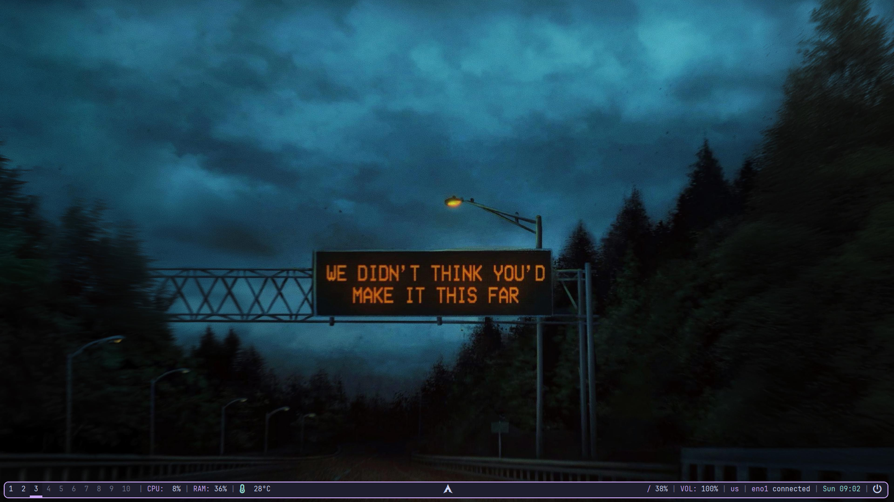

# Dotfiles
This is my setup for bspwm
- Polybar with cappucino theme
- nitrogen
- pico
- neofetch
- fastfetch
- Betterlockscreen

# Shotcuts
>[!TIP]
> - `super + x`       # lock screen
> - `super + return`  # open kitty
> - `super + space`   # open rofi
> - `super + e`       # open dolphin

# Comment
- If you have something error or have comment, feel free! even my setup i based on other's dotfiles. 

# Installing
>[!WARNING]
> The install.sh still in beta, don't use it

# Some links about the source
- [polybar](https://github.com/polybar/polybar)
- [betterlockscreen](https://github.com/betterlockscreen/betterlockscreen)
- [source of fastfetch](https://github.com/Meow0x7E/config-fastfetch) (I haven't used it anymore)
- [picom](https://github.com/yshui/picom)

# Preview

